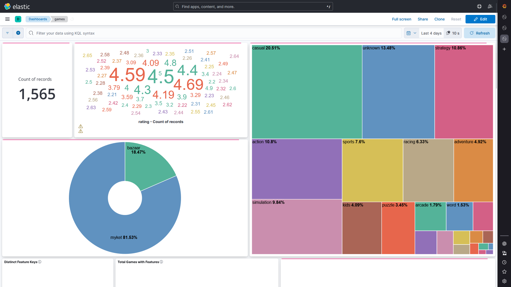
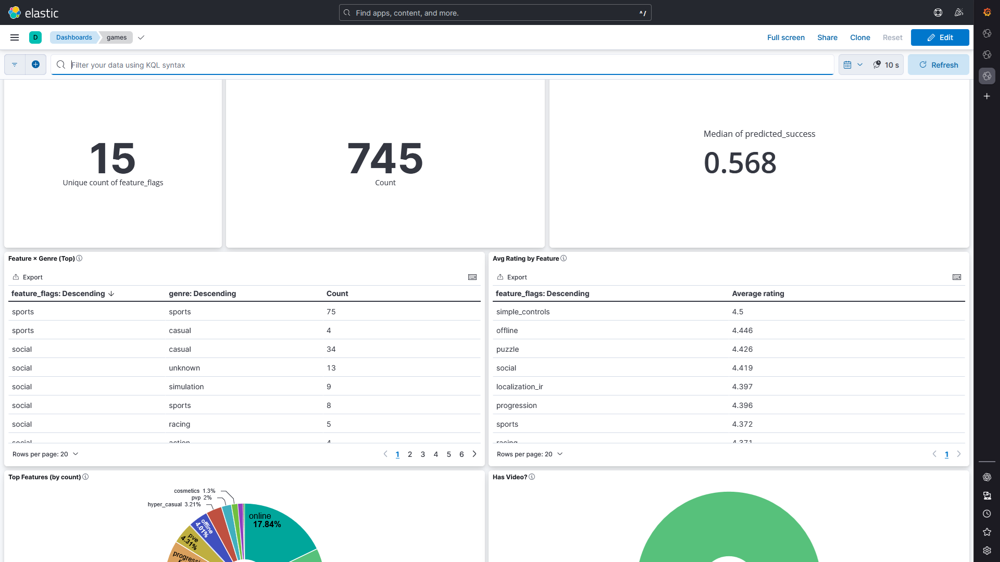
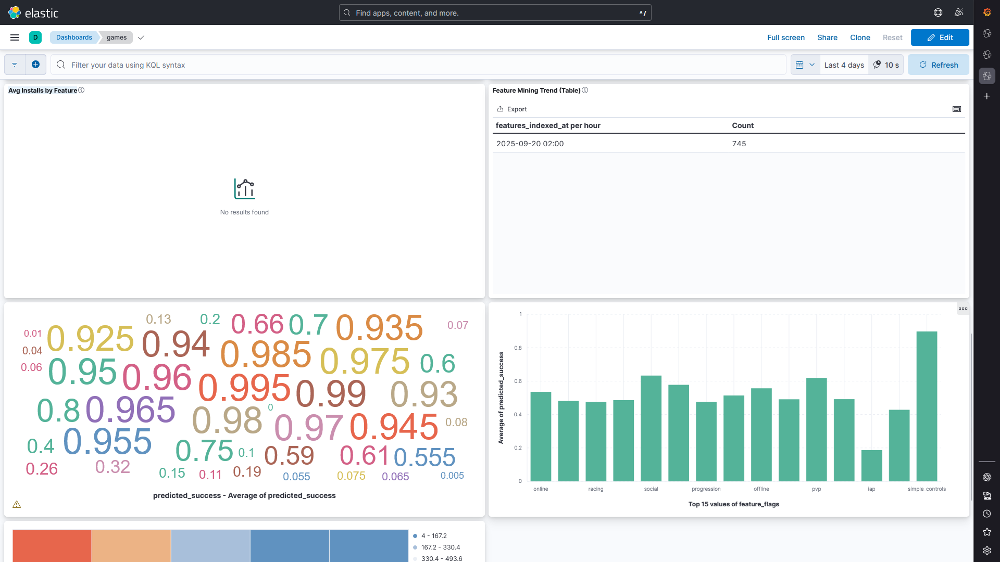

<!-- ./README.md -->
# IR Game Insights

تحلیل و پایش بازی‌های موبایل (بازار / مایکت) با **Elasticsearch + Kibana + Redis + PostgreSQL** و سرویس‌های Python برای **اسکریپت خزنده**، **استخراج فیچر** و **مدل‌سازی موفقیت**.

## فهرست
- [معماری](#معماری)
- [شروع سریع](#شروع-سریع)
- [شاخص‌ها و ایندکس‌ها](#شاخصها-و-ایندکسها)
- [استخراج فیچر (Miner)](#استخراج-فیچر-miner)
- [مدل‌سازی و امتیازدهی (Analyzer)](#مدلسازی-و-امتیازدهی-analyzer)
- [داشبوردهای Kibana](#داشبوردهای-kibana)
  - [ایمپورت از UI](#ایمپورت-از-ui)
  - [ایمپورت با API](#ایمپورت-با-api)
  - [ساخت Data View و رفع مشکل فیلدهای Empty](#ساخت-data-view-و-رفع-مشکل-فیلدهای-empty)
  - [نمودارهای پیشنهادی](#نمودارهای-پیشنهادی)
- [عیب‌یابی](#عیبیابی)
- [نسخه‌بندی و تگ‌ها](#نسخهبندی-و-تگها)
- [اسکرین‌شات‌ها](#اسکرینشاتها)

---

## معماری
- **Elasticsearch**: ایندکس‌های `games` و `assets` برای دیتاهای اپ و رسانه‌ها (آیکن/اسکرین‌شات).  
- **Kibana**: ساخت دیتاوِیو، ویژوال‌ها و داشبوردها.  
- **scraper**: جمع‌آوری داده از استورها.  
- **miner**: استخراج پرچم‌های فیچر از متن/متادیتا و شمارش رسانه‌ها از ایندکس `assets`.  
- **analyzer**: آموزش مدل ساده و امتیازدهی `predicted_success` و `feature_score` روی ایندکس `games`.

## شروع سریع
```bash
# 1) اجرای سرویس‌ها
docker compose up -d es kibana redis postgres

# 2) ساخت ایندکس‌ها و مپینگ‌ها
# (es-init در docker-compose این کار را انجام می‌دهد؛ در صورت نیاز مجدد اجرا کنید)
docker compose run --rm es-init

# 3) اجرای خزنده (در صورت نیاز)
docker compose up -d scraper

# 4) اجرای Miner برای پر کردن فیلدهای فیچر و شمارش اسکرین‌شات/آیکن
docker compose run --rm miner

# 5) آموزش مدل و اسکوردهی
docker compose run --rm analyzer python /app/train.py
docker compose run --rm analyzer python /app/score.py
```

## شاخص‌ها و ایندکس‌ها
- **games**: فیلدهای اصلی مانند `title`, `genre`, `rating`, `ratings_count`, `indexed_at`,  
  و فیلدهای استخراجی/مدلی: `feature_flags[]`, `assets_screenshot_count`, `assets_icon_count`,  
  `features_indexed_at`، `predicted_success`, `feature_score`.
- **assets**: رکوردهای `icon` و `screenshot` به‌ازای هر اپ (`store`, `app_id`, `type`).

> اگر پس از افزودن فیلدهای جدید (مثلاً `assets_screenshot_count`) چیزی در Kibana نشان داده نشد،
> باید **Data View** را **Refresh field list** کنید (راهنما پایین).

## استخراج فیچر (Miner)
- فایل: `services/miner/miner.py`
- کارها:
  - استخراج `feature_flags` از `title` و `description` با دیکشنری کلیدواژه.
  - شمارش رسانه‌ها از ایندکس `assets` → ذخیره در `assets_screenshot_count` و `assets_icon_count`.
  - محاسبه‌ی سریع `success_score` کمکی.
  - ثبت زمان پردازش در `features_indexed_at`.

اجرا:
```bash
docker compose run --rm miner
```

## مدل‌سازی و امتیازدهی (Analyzer)
- فایل‌ها: `services/analyzer/train.py` ، `services/analyzer/score.py`
- آموزش:
  - فیچرهای عددی: `rating`, `log_ratings_count`, `assets_screenshot_count`, `assets_icon_count`
  - فیچرهای کتگوریک: ژانر (OneHot) با برش به Top-K
  - فیچرهای چندگانه: فیچر فلگ‌ها به صورت multi-hot بر اساس Top-K flags
- اسکوردهی:
  - خروجی‌ها: `predicted_success` (احتمال موفقیت مدل) و `feature_score` (نسبتِ وجود فلگ‌های TOP)

اجرا:
```bash
docker compose run --rm analyzer python /app/train.py
docker compose run --rm analyzer python /app/score.py
```

---

## داشبوردهای Kibana

### ایمپورت از UI
1. وارد Kibana شوید: `http://localhost:5601`
2. مسیر: **Stack Management → Saved Objects → Import**
3. فایل NDJSON را انتخاب کنید (مثلاً: `dashboards/kibana/ir-game-insights-pro.ndjson` و یا داشبورد فیچرها).
4. گزینه **Automatically overwrite** را تیک بزنید و **Import** کنید.

> اگر Data View لازم (مثلاً با عنوان `games`) از قبل موجود نباشد، ممکن است Kibana هنگام ایمپورت پیشنهاد ساخت بدهد.
> در غیر این صورت، بخش بعد را برای ساخت Data View ببینید.

### ایمپورت با API
```bash
# ایمپورت Saved Objects (داشبورد/ویژوال‌ها) با curl
curl -X POST "http://localhost:5601/api/saved_objects/_import?overwrite=true" \
  -H "kbn-xsrf: true" \
  --form file=@dashboards/kibana/ir-game-insights-pro.ndjson
```

> اگر فایل جداگانه‌ای برای داشبورد فیچرها دارید (مثلاً `games-feature-insights.ndjson`)،
> همان فرمان بالا را با مسیر فایل مربوطه اجرا کنید.

### ساخت Data View و رفع مشکل فیلدهای Empty

#### ساخت Data View (از UI)
- مسیر: **Stack Management → Data Views → Create data view**
- Title: `games`
- Name: `Games`
- Time field: `indexed_at`  *(در صورت نیاز می‌توانید **No time field** بزنید)*
- Create data view

#### ساخت Data View (با API)
```bash
curl -X POST "http://localhost:5601/api/data_views/data_view" \
  -H "kbn-xsrf: true" -H "Content-Type: application/json" \
  -d '{"data_view":{"title":"games","name":"Games","timeFieldName":"indexed_at"}}'
```

#### رفع مشکل «Empty field» بعد از تغییر مپینگ
اگر مپینگ ایندکس تغییر کرد یا فیلد جدیدی (مثل `assets_screenshot_count`) به داکیومنت‌ها اضافه شد
ولی Kibana هنوز آن را **empty** می‌بیند:
1. مسیر: **Stack Management → Data Views → Games**
2. دکمه **Refresh field list** را بزنید.
3. در ویژوال‌ها، فیلد را دوباره انتخاب/ذخیره کنید.

**با API: Refresh field list**
1) اول **ID** دیتاوِیو را بگیرید:
```bash
curl -s "http://localhost:5601/api/data_views/data_view" -H "kbn-xsrf: true" | jq .
```
2) سپس:
```bash
curl -X POST "http://localhost:5601/api/data_views/data_view/<DATA_VIEW_ID>/fields/refresh" \
  -H "kbn-xsrf: true"
```

> اگر با خطای جاوااسکریپتی مثل `visTypeXy ... e is undefined` مواجه شدید،
> نوع ویژوال را به **Lens** تغییر دهید (توصیه‌شده) یا از Visualization‌های ساده‌تر (Pie/Metric/Table) استفاده کنید.

### نمودارهای پیشنهادی
- **Metric**: `Avg(predicted_success)` روی ایندکس `games`
- **Bar (Lens)**: `Terms(feature_flags)` + **Average(predicted_success)**  
  *(برای پرهیز از باگ XY قدیمی، از Lens استفاده کنید)*
- **Histogram**: توزیع `feature_score` با Interval= `0.05` یا `0.1`  
  X: Histogram on `feature_score` — Y: Count

---

## عیب‌یابی
- **No mapping found for ... to sort on**: مپینگ فیلد را اضافه کنید و سپس **reindex/update**/اسناد را به‌روزرسانی کنید.  
- **Field appears empty در Kibana**: Data View را **Refresh field list** کنید.  
- **شاخص assets هنوز خالی است**: ابتدا scraper را اجرا کنید تا تصاویر جمع شود، سپس miner را اجرا کنید.

---

## نسخه‌بندی و تگ‌ها
پس از تکمیل یک فاز، تگ معنی‌دار بزنید:
```bash
git pull origin main
git tag -a v0.4-feature-mining-and-modeling -m "Feature mining + modeling (+ Kibana dashboards)"
git push --tags
```


## اسکرین‌شات‌ها

> مسیرها نسبی به ریشه مخزن هستند.

| نمایی از داشبورد |
| --- |
|  |
|  |
|  |

